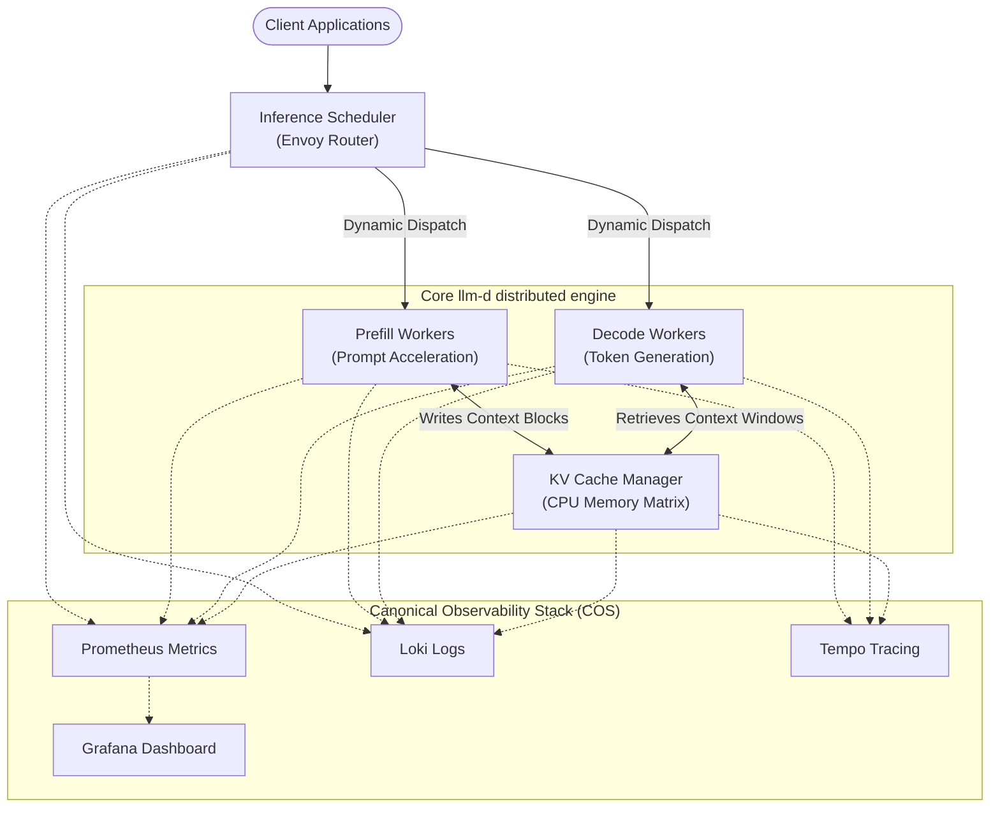

# Juju charms for llm-d 

**Starring this repo will help it to gain visibility**

LLM-D Juju charms that deliver a state-of-the-art disaggregated GenAI model serving capability for extreme scale Large Language Model (LLM) and multi-modal model clusters using Canonical's open source "[Juju](https://canonical.com/juju)" operations management system. 

The solution scales by decomposing the different functions (eg. Prefill vs. Decoding phases), and by delivering a global Key-Value (KV) cache that offloads KV caches from GPU memory to CPU memory. The framework enables disaggregated, horizontal scaling of AI model serving workloads while maintaining observability and optimized request routing via Prometheus, with logging to Loki and tracing via Tempo.

## Architecture

This solution disaggregates LLM inference layers into independently scaling microservices governed by `juju` charm operators:

* **Inference Scheduler** (`llm-d-inference-scheduler-k8s`): High performance frontend routing mesh powered via Envoy. Acts as the global traffic router, dynamically routing prompts to the best placed node in the cluster to fulfill the request.
* **Prefill Workers** (`llm-d-prefill-k8s`): High-throughput prompt ingestion. Handles prompt contexts and accelerating KV cache writes, making the decoding flow more efficient
* **Decode Workers** (`llm-d-decode-k8s`): Autoregressive token generation loops
* **KV Cache Manager** (`llm-d-kv-cache-k8s`): Stores the generated KV tokens efficiently, offloading KV caches from GPU to CPU memory

The solution also makes use of the "COS" observability stack charms.

## Hardware Profile & Declarative Topologies

Terraform modules are available for each of the components, or use the shell script `deploy.sh`.

The default profiles configure:
* Compute nodes utilize NVIDIA accelerators via `gpu`.
* Infiniband networking resources are provisioned via `ib`.
* Settings for large shared-memory buffers (`/dev/shm`) and Unix Domain Sockets (`/tmp/tokenizer`) where necessary

## Usage

There are two scripts:

### 1. `build.sh`
This script configures build dependencies for Ubuntu, necessary permissions, and packages all 4 charms into deployable `.charm` assets.

### 2. `deploy.sh`
**Prerequisites**
Make sure you have a recent version of Kubernetes running on your Kubernetes cluster (ie. 1.32+), with GPUs, Infiniband and the appropriate NVIDIA Operator installed, Multus CNI and the SR-IOV Network Device Plugin. You may also need to elevate permissions for RDMA so ensure you have and can grant sufficient privileges on your cluster.

The `deploy.sh` script will provision the entire solution:
1. Creates a `Juju model` called `llm-d-inference` which in turn creates a Kuberenetes namespace with the same name.
2. Deploys the components and associated charm operators. Check the deployment `constraints` and adjust as required. 
4. Integrates all of the components via the juju model.
